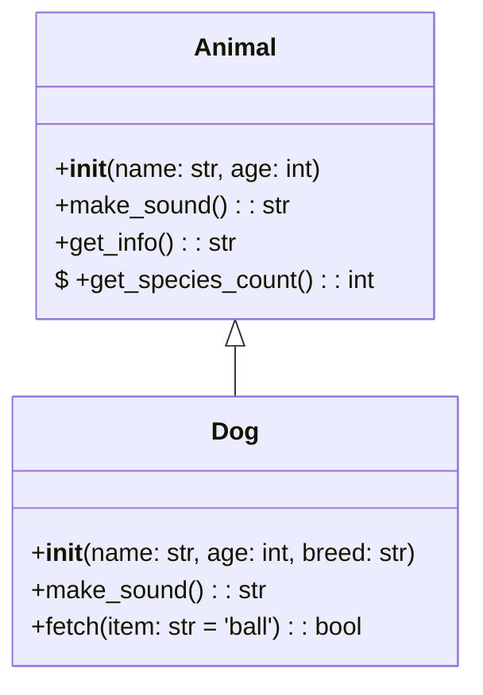

# @infodb/diagram

Python class diagram generator for Mermaid format. This tool parses Python source code using AST and generates Mermaid class diagrams showing class relationships, methods, and attributes.

## Installation

```bash
pnpm install @infodb/diagram
```

## Usage

### Command Line Interface

```bash
# Generate diagram from Python directory
pnpx @infodb/diagram ./src ./output/diagram.mmd

# Generate diagram from single Python file
pnpx @infodb/diagram ./example.py ./diagram.mmd

# Include private methods and attributes
pnpx @infodb/diagram ./src ./diagram.mmd --include-private

# Include class docstrings
pnpx @infodb/diagram ./src ./diagram.mmd --include-docstrings
```

### Programmatic API

```typescript
import { generateClassDiagram } from '@infodb/diagram';

// Generate diagram
const mermaidCode = await generateClassDiagram(
  './python-source',
  './output/diagram.mmd',
  {
    includePrivate: false,
    includeDocstrings: false
  }
);

console.log(mermaidCode);
```

## Features

- **AST-based parsing**: Uses Python's AST module for accurate code analysis
- **Class relationships**: Automatically detects inheritance relationships
- **Method signatures**: Includes parameter types and return types when available
- **Visibility indicators**: Shows public (+), protected (#), and private (-) members
- **Static methods**: Identifies static and class methods
- **Type annotations**: Preserves Python type hints in the diagram
- **Docstring support**: Optionally includes class docstrings
- **Flexible input**: Works with single files or entire directories

## Output Format

The tool generates standard Mermaid class diagrams:



## Requirements

- Node.js 18+
- Python 3.7+ (for AST parsing)

## Development

```bash
# Install dependencies
pnpm install

# Build
pnpm build

# Test
pnpm test
```